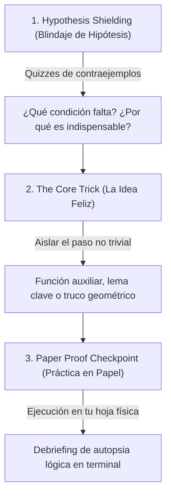

# 🎓 Manual Maestro del Learning Harness
### Guía de Estudio con Pi, Obsidian y Modelos de Lenguaje

Este sistema es un **entorno de aprendizaje guiado por IA de alta fidelidad**, diseñado específicamente para exactas, ingeniería y programación. Su objetivo no es la memorización pasiva de datos sueltos, sino la **comprensión profunda por primeros principios**, la **práctica deliberada de teoremas y ejercicios**, y la **consolidación a largo plazo en Obsidian**.

---

## 📑 Tabla de Contenidos
1. [Filosofía Pedagógica](#1-filosofía-pedagógica)
2. [Componentes del Sistema](#2-componentes-del-sistema)
3. [Instalación y Configuración](#3-instalación-y-configuración)
4. [Casos de Uso](#4-casos-de-uso)
   - [Caso A: Conceptos Sueltos y Programación](#caso-a-conceptos-sueltos-y-programación)
   - [Caso B: Materias Universitarias (PDFs, Teoremas y Práctica)](#caso-b-materias-universitarias-pdfs-teoremas-y-práctica)
   - [Caso C: Libros Técnicos Completos (.epub y PDFs largos)](#caso-c-libros-técnicos-completos-epub-y-pdfs-largos)
5. [El Protocolo de Teoremas Matemáticos](#5-el-protocolo-de-teoremas-matemáticos)
6. [Flujo de Trabajo con Obsidian](#6-flujo-de-trabajo-con-obsidian)
7. [Economía de Tokens y Rendimiento](#7-economía-de-tokens-y-rendimiento)
8. [Atajos, Comandos y Solución de Problemas](#8-atajos-comandos-y-solución-de-problemas)

---

## 1. Filosofía Pedagógica

El sistema se apoya en tres leyes fundamentales de la ciencia cognitiva:

1. **El Conocimiento es un Grafo (DAG), no una Lista:**
   - Dos personas pueden recitar los mismos hechos, pero quien los entiende los deriva desde un puñado de **verdades incondicionales** (primeros principios).
   - El objetivo es **el "click" mental**: el momento en que una pila de hechos aislados colapsa y se comprime en unas pocas ideas generadoras.
2. **Descubrimiento Motivado (*"¿Cómo pude haber descubierto esto?"*):**
   - Estilo *3Blue1Brown*. Ninguna fórmula ni definición aparece por decreto divino; cada paso se motiva desde el problema concreto que busca resolver.
3. **Active Recall & Testing Effect (Evaluación Formativa Calibrada):**
   - Evaluar con preguntas tipo `quiz` antes de enseñar para mapear tu frontera de conocimiento (búsqueda binaria de tu nivel), y después de cada concepto para asegurar que el nodo quedó firme antes de construir encima.

---

## 2. Componentes del Sistema

```
learn/
├── skills/
│   ├── teach/SKILL.md             # Pedagogía central, teoremas, scaffolding y flashcards
│   └── visualize/SKILL.md         # Director creativo de diagramas visuales
├── extensions/
│   ├── quiz.ts                    # Pop-up interactivo evaluado con feedback inmediato (✓/✗)
│   ├── ask-user-question.ts       # Pop-up para decisiones, preferencias o rumbos
│   ├── doc-reader.ts              # Lector quirúrgico de PDFs y EPUBs (índices, páginas, capítulos)
│   ├── md-log.ts                  # Espejo en tiempo real hacia una nota limpia en Obsidian
│   └── visual-tools/              # Renderizador de Mermaid (Chrome) y SVG (rsvg/magick)
├── scripts/
│   └── doc_parser.py              # Motor Python de extracción y búsqueda de documentos
└── agents/
    ├── researcher.md              # Validador de hechos en web y en apuntes de cátedra
    ├── mermaid-maker.md           # Diseñador de diagramas de flujo y relaciones
    └── svg-maker.md               # Diseñador geométrico de vectores, planos y funciones
```

---

## 3. Instalación y Configuración

### Estado en tu sistema
- **`pi` CLI:** Ya está instalado globalmente en tu entorno Node (`v24.18.0`) con la versión `0.87.1`.
- **Integración de Terminal:** Tu shell `zsh` tiene configurado el cargador automático para que `pi` funcione desde cualquier terminal.
- **Poppler Utilities (`pdftotext`, `pdfinfo`):** Listos en `/usr/bin/`.

### Configuración de Proveedores / API Keys
`pi` funciona con tus proveedores de modelos preferidos. Para configurar tu acceso:
```bash
# Opción 1: Login o configuración guiada por pi
pi auth

# Opción 2: Usar variables de entorno en tu ~/.zshrc o sesión
export ANTHROPIC_API_KEY="tu-key"
# O bien Gemini, OpenAI, DeepSeek, OpenRouter, OpenCode:
export GEMINI_API_KEY="tu-key"
export DEEPSEEK_API_KEY="tu-key"
export OPENROUTER_API_KEY="tu-key"
```

---

## 4. Casos de Uso

### Caso A: Conceptos Sueltos y Programación
*Ideal para dudas puntuales, arquitecturas de software, algoritmos o conceptos teóricos.*

1. Abre la terminal en tu carpeta de estudio:
   ```bash
   cd ~/codes/learn   # o tu carpeta con la configuración de pi
   pi
   ```
2. Si quieres que la clase quede guardada en Obsidian, vincula una nota:
   ```text
   /md-log ~/mi-boveda/Estudio/Concurrencia_Go.md
   ```
3. Pide aprender el tema:
   > *"Quiero entender a fondo cómo funciona el planificador (scheduler) de Go y los canales por dentro."*
4. **Qué esperar del sistema:**
   - Te lanzará un `quiz` interactivo para ver qué tanto sabes de hilos de sistema operativo y multiplexación.
   - Presentará un plan en prosa y un grafo Mermaid con las verdades base.
   - Explicará nodo por nodo, intercalando quizzes rápidos y diagramas generados en tu carpeta `viz/`.

---

### Caso B: Materias Universitarias (PDFs, Teoremas y Práctica)
*Para materias de exactas e ingeniería organizadas por carpetas de materia, con un apunte `.md` por Unidad y sus PDFs de cátedra al lado.*

#### Estructura recomendada en tu Bóveda:
```
Mi_Boveda_Obsidian/
├── Analisis_Matematico_II/
│   ├── apuntes_u1_limites.pdf
│   ├── Unidad_1_Limites.md
│   └── Unidad_2_Derivadas.md
├── Sistemas_Operativos/
│   ├── slides_concurrencia.pdf
│   └── Unidad_1_Hilos.md
└── Tema_Suelto_Programacion.md   <-- En la raíz cuando sea un tema libre
```

1. **Inicia `pi` en la raíz de tu Bóveda:**
   ```bash
   cd ~/Mi_Boveda_Obsidian
   pi
   ```
2. **Vincula tu apunte (si no existe, se crea automáticamente junto a su carpeta):**
   ```text
   /md-log Analisis_Matematico_II/Unidad_2_Derivadas.md
   ```
   *(O para un tema libre en la raíz: `/md-log Algoritmo_Raft.md`).*
3. **Pide estudiar usando tu apunte:**
   > *"Vamos a estudiar el Teorema del Valor Medio y hacer ejercicios prácticos usando el apunte `apuntes_u1_limites.pdf`."*
4. **Flujo inteligente y robusto del sistema:**
   - **Búsqueda automática:** No necesitas escribir toda la ruta; el sistema busca `apuntes_u1_limites.pdf` dentro de las subcarpetas de la materia automáticamente.
   - **Extracción quirúrgica:** Con `read_doc_section` solo lee las páginas que corresponden al tema del día, manteniendo la memoria limpia y ahorrando tokens.
   - **Alineación con la cátedra:** Adopta la notación exacta de tu profesor (variables, definiciones).
   - **Protocolo de Teoremas:** Te ataca con contraejemplos para blindar las hipótesis, aísla la idea feliz y te envía al papel con el `Checkpoint de Papel`.
   - **Ejercicios prácticos con andamiaje:** Te guía paso a paso en la resolución de problemas de examen.
   - **Cierre con Flashcards:** Inserta automáticamente el bloque `#flashcards` al final del apunte de la unidad.

---

### Caso C: Libros Técnicos Completos (.epub y PDFs largos)
*Para estudiar manuales de 500+ páginas sin saturar la memoria ni quemar tokens.*

1. Ten tu libro listo (ejemplo: `libros/tanenbaum_redes.epub` o `libros/cormen_algoritmos.pdf`).
2. Inicia `pi` y vincula la nota correspondiente:
   ```text
   /md-log ~/mi-boveda/Libros/Redes_Tanenbaum.md
   ```
3. Consulta el índice o pide un capítulo específico:
   > *"Quiero estudiar el Capítulo 3 sobre la Capa de Transporte del libro `libros/tanenbaum_redes.epub`."*
4. **Manejo quirúrgico:**
   - El agente leerá la tabla de contenidos con `inspect_doc`.
   - Extraerá únicamente el capítulo 3 (`read_doc_section`).
   - Mantendrá el resto de los 15 capítulos fuera de la conversación, garantizando respuestas instantáneas y máximo ahorro de tokens.

---

## 5. El Protocolo de Teoremas Matemáticos

En exactas, los exámenes evalúan que seas capaz de reproducir y aplicar demostraciones formalmente. El sistema sigue un proceso en 3 pasos:



1. **Hypothesis Shielding:** Se escribe el teorema formalmente en Obsidian (`> [!theorem]`). El agente te ataca con preguntas: *"¿Qué pasa si la función no es derivable en el abierto $(a, b)$?"*. Esto te obliga a memorizar las condiciones exactas entendiendo su necesidad lógica.
2. **The Core Trick (La Idea Feliz):** Toda demostración larga tiene un pivote que la destraba. El agente te pregunta socráticamente: *"Antes de calcular: ¿cuál es la construcción auxiliar que permite aplicar Rolle aquí?"*.
3. **Paper Proof Checkpoint:**
   El agente emite un aviso:
   > `> [!important] 📝 Checkpoint de Papel: Demostración`  
   > *Toma tu hoja y escribe la demostración completa desde las hipótesis hasta la tesis aplicando la idea clave. Cuando termines, avísame diciendo 'listo' o indícame en qué paso te trabaste.*
   Cuando regresas, te hace una pregunta de verificación rápida para confirmar que no hubo saltos lógicos falsos.

---

## 6. Flujo de Trabajo con Obsidian

A diferencia de un chat convencional, la extensión `md-log.ts` ha sido refinada para producir un **apunte de cátedra limpio**:

### Callouts nativos utilizados:
- `> [!definition] Nombre`: Para definiciones formales rigurosas.
- `> [!theorem] Teorema`: Para enunciados matemáticos con hipótesis y tesis.
- `> [!example] Ejercicio`: Para problemas prácticos resueltos paso a paso.
- `> [!tip] Idea Clave`: Para la intuición o truco de una demostración.
- `> [!warning] Trampa de Parcial`: Para errores conceptuales típicos.
- `![[viz-tema.png|500]]`: Diagramas e imágenes incrustados automáticamente.

### Bloque de Spaced Repetition (Flashcards)
Al finalizar la sesión, el apunte incluirá al pie un bloque compatible con el plugin *Spaced Repetition* de Obsidian:
```markdown
## 🧠 Banco de Repaso (Flashcards)

#flashcards/analisis-u2

¿Cuáles son las 3 hipótesis del Teorema de Rolle?::1) Continua en $[a,b]$, 2) Derivable en $(a,b)$, 3) $f(a) = f(b)$.

En el Teorema del Valor Medio, la idea clave es construir la función auxiliar {==$g(x) = f(x) - \left[ f(a) + \frac{f(b)-f(a)}{b-a}(x-a) \right]$==} para luego aplicar {==el Teorema de Rolle==}.
```

---

## 7. Economía de Tokens y Rendimiento

| Práctica Inadecuada | Cómo lo resuelve este Harness |
| :--- | :--- |
| Enviar un PDF de 100 páginas al prompt (~60,000 tokens) | Usa `read_doc_section` para leer solo las 8 páginas del tema actual (~4,000 tokens). |
| Enviar un EPUB de 400 páginas | `inspect_doc` extrae el índice; se lee únicamente el capítulo en estudio. |
| Repetir explicaciones largas | Quizzes concisos de opciones niveladas donde la justificación solo se muestra tras responder. |
| Modelos de subagentes rígidos | Subagentes desacoplados que heredan el modelo de tu sesión activa sin forzar APIs externas innecesarias. |

---

## 8. Atajos, Comandos y Solución de Problemas

### Comandos de Terminal en `pi`
- `/md-log <ruta.md>`: Conecta el archivo de Obsidian a la sesión y vuelca la historia.
- `/md-unlog`: Desconecta la sincronización con el archivo.

### Navegación en los Quizzes de la TUI
- `↑ / ↓`: Navegar entre opciones.
- `Enter`: Seleccionar y confirmar la respuesta.
- `Tab`: Ir al campo de nota opcional (para escribir una duda o aclaración sobre tu respuesta antes de enviarla).
- `Espacio`: Marcar/desmarcar en preguntas de selección múltiple.
- Opción *"I don't know"*: Selecciónala siempre que no tengas certeza; el sistema lo tratará como un vacío que debe explicar, no como una respuesta incorrecta al azar.

### Herramienta CLI de Documentos (Independiente)
También puedes usar el script de inspección directamente en tu terminal:
```bash
# Ver información y cantidad de páginas
python3 scripts/doc_parser.py info archivo.pdf

# Ver índice de un libro
python3 scripts/doc_parser.py toc libro.epub

# Extraer un rango de páginas específico
python3 scripts/doc_parser.py read apunte.pdf --pages 12-25

# Buscar un término o teorema en el documento
python3 scripts/doc_parser.py search apunte.pdf "Rolle"
```
